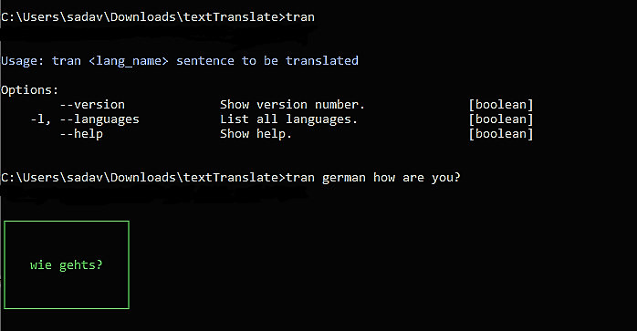

<p align="center">A CLI App to translate text between languages in the terminal.</p>
<br>

<p align="center">
  
</p>


---

## Usage

```
> tran
Usage: tran <lang_name> sentence to be translated

Options:
        --version             Show version number.              [boolean]
    -l, --languages           List all languages.               [boolean]
        --help                Show help.                        [boolean]

```

> :warning: **You can also use the ISO-639-1 code of the language instead of writing the full language name**

<br>

## Installation

1. Clone the repository and then navigate to it.
2. Run ```npm install``` to install the dependencies.
3. Run ```npm install -g .``` to install the CLI. <br>
4. Now you are good to go and can use the CLI globally!

Type ```tran``` or ```tran --help``` to get started.

<br>

